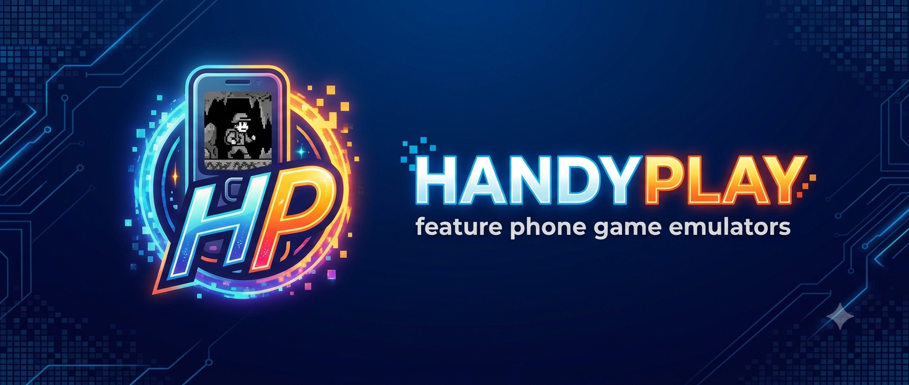
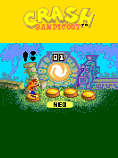
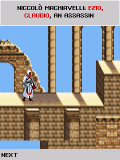
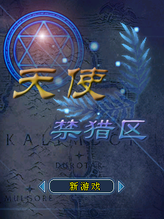

<p align="center">
  
</p>

<p align="center">
  <a href="https://handyplay-demo.promentol.workers.dev"><b>▶ Play the live demo</b></a>
  &nbsp;·&nbsp; runs in your browser (best in Google Chrome)
</p>

# Handyplay — OSS emulator cores

Open-source emulators for the games that shipped on early-2000s feature phones —
the J2ME-adjacent platforms that never had a preservation story. Each core is
reimplemented from scratch in **Zig**, is frontend-agnostic (a portable `core/`
plus thin frontends), and is built to be embedded anywhere: native desktop, the
browser, or RetroArch.

## Screenshots

Real frames captured from the cores running unmodified games:

<table>
<tr>
  <td align="center"><br><sub><b>exen-core</b> · Crash Bandicoot</sub></td>
  <td align="center"><br><sub><b>mre-core</b> · Assassin's Creed</sub></td>
  <td align="center"><br><sub><b>mrp-core</b> · Mythroad</sub></td>
</tr>
</table>

## Why Handyplay

For most of a decade before the iPhone, games shipped to feature phones by the
**tens of thousands** — across MediaTek MRE, sky-mobi Mythroad, ExEn, Mophun, DoJa,
BREW, and Symbian — onto **billions** of handsets worldwide. By install base it was
one of the largest gaming platforms ever. Almost none of it survived.

Consoles and arcades have decades of emulators, ROM archives, and active
preservation communities. The feature-phone era right before the smartphone has
almost nothing:

- **No emulator** for most of these platforms — the runtimes were proprietary and
  the source was never released.
- **Dead distribution** — the carrier portals, download servers, and DRM that
  delivered the games are long gone, so the binaries are scattered or lost.
- **Dying hardware** — the only devices that can still run them are aging out, and
  each one that stops booting takes its library with it.

Handyplay builds the missing tools: clean-room runtimes in portable Zig that boot
these games again on desktop, in the browser, or in RetroArch — as deterministic
VMs with save-states, so a run can be captured, shared, and replayed exactly. The
goal is to make these never-emulated libraries playable and preservable while the
hardware that still runs them survives.

## This repo & the Handyplay app

**`handyplay-oss` is the engine room: the open-source libretro cores.** They run
in any libretro host (RetroArch, Nostalgist.js) and are free and open forever.

The same cores power **Handyplay**, an upcoming consumer app for **iOS, Android,
Web, and Telegram** that wraps them in a polished library, controls, and sync.
**Handyplay Plus** is the subscription tier.

| | `handyplay-oss` | Handyplay | Handyplay Plus |
|---|---|---|---|
| What it is | Open-source emulator cores | Consumer app | Subscription tier |
| Price | Free / open source | Free | Subscription |
| Platforms | Any libretro host (RetroArch, Nostalgist.js) | iOS · Android · Web · Telegram | iOS · Android · Web · Telegram |
| Emulator cores | mre, mrp, exen (+ roadmap) | All cores, bundled | All cores, bundled |
| Save-states | ✓ | ✓ | ✓ |
| Cloud save sync | — | ✓ | ✓ |
| Shaders | ✓ (libretro) | — | ✓ |
| Feature-phone skins | — | Limited | Unlimited |
| Game slots (games you can install) | — | Limited | Unlimited |
| Setup | Bring your own host, BIOS & games | Zero-config | Zero-config |

### List of emulators

| Core | Platform | Format | CPU / VM |
|------|----------|--------|----------|
| [`mre-core`](mre-core)   | MediaTek MRE / MAUI                 | `.vxp` | ARM (vendored Unicorn) |
| [`mrp-core`](mrp-core)   | MediaTek MRP / sky-mobi Mythroad    | `.mrp` | ARM (vendored Unicorn) |
| [`exen-core`](exen-core) | ExEn 2                              | `.exn` | Java-bytecode VM (pure interpreter) |

## Design

Every core is split into a **portable core** and **thin frontends**:

```
<core>/
  core/                 # the emulator — no I/O, no platform assumptions
  natives/              # platform API surface the games call into
  frontends/
    sdl/                # native desktop (SDL3) — the reference player
    libretro/           # libretro core for RetroArch / Nostalgist.js   (roadmap)
```

The same `core/` drives both frontends — the frontend only supplies a
framebuffer, input, audio, and storage. Adding a new host means writing a small
frontend, never touching the emulator.

### Save-states

Each core exposes a serialize/deserialize pair (`*_state_size` / `*_state_save` /
`*_state_load`), verified by snapshot → run → restore → run framebuffer-identical
roundtrips. This requires fully deterministic execution: every VM uses a
tick-driven clock and an on-VM PRNG — no wall-clock reads, no global RNG — so
replay and rewind reproduce exactly.

## Building

Each core builds natively with Zig (0.15+):

```sh
cd mre-core      # or mrp-core / exen-core
zig build                       # native SDL frontend
zig-out/bin/<core> path/to/game
```

The native **libretro cores** (for RetroArch and any other libretro frontend) are
produced by the top-level orchestrator:

```sh
./build-cores.sh                # all cores -> dist/cores/<core>_libretro.{so,dylib}
./build-cores.sh exen           # one core
```

> Compiled artifacts are **not** committed — they are build outputs. Run the
> scripts above to produce them.

A libretro core is a per-platform shared library, so it runs anywhere RetroArch
does — Windows (`.dll`), Linux / Android / *BSD / ARM handhelds (`.so`), macOS /
iOS (`.dylib`). Cross-compile with a Zig target triple:

```sh
TARGET=x86_64-windows-gnu  ./build-cores.sh exen   # -> .dll
TARGET=aarch64-linux-gnu   ./build-cores.sh exen   # -> .so  (handhelds, Android)
```

`exen-core` is pure Zig and cross-compiles to any target out of the box.
`mre-core` / `mrp-core` link a vendored Unicorn, so cross-compiling them also
needs a `libunicorn` built for that target.

Per-core build details, the native-API surface, and reverse-engineering notes
live in each core's `DOCS.md`.

### Why no prebuilt desktop binaries?

Each core ships an **SDL3 frontend** (`frontends/sdl/`) — that's our reference
player during development, and you can build and run it yourself with `zig build`.
What we *don't* ship is signed, packaged desktop downloads: continuous integration
across macOS/Windows/Linux plus Apple/Microsoft code-signing and notarization is an
ongoing cost we can't take on right now.

Instead we distribute **libretro cores**, so you can play in
[RetroArch](https://www.retroarch.com/) — on your favorite RetroArch frontend, on
desktop, or on a handheld. For a turn-key experience, the commercial **Handyplay**
app covers iOS, Android, Web, and Telegram.

## BIOS / fonts

These cores are clean-room reimplementations; the firmware and font blobs the
original platforms shipped are **not** redistributed and must be supplied by the
user. The cores locate each file by **MD5** (filename-independent, RetroArch
convention) in the system directory, so any filename works as long as the hash
matches.

| Core | Required? | File | Size | MD5 | Where to get |
|------|-----------|------|------|-----|--------------|
| `mre-core`  | **No** — self-contained | — | — | — | The `.vxp` carries everything; no BIOS needed. |
| `mrp-core`  | **Yes** | `cfunction.ext` | 332,116 | `b87d3bca0bd693861bfddd1fb430eb95` | User-supplied — the compiled Mythroad C-function engine. |
| `mrp-core`  | **Yes** (CJK text) | `gb16.uc2` | 2,097,152 | `f21f21559a38f8927597cc2088525072` | User-supplied — Mythroad `system/` font. |
| `mrp-core`  | **Yes** (CJK text) | `gb12.uc2` | 1,179,630 | `c2ead6ea893b43cf9c661f6d78655736` | User-supplied — Mythroad `system/` font. |
| `exen-core` | **Yes** | `exen_builtins.bin` | 44,940 | `870bef21d6f269e3e3d91943c66de8e8` | User-supplied — the built-in 4CVP class blob from the stock ExEn 2 simulator. |

Place the matching files in the libretro **system directory** (RetroArch's
`system/` folder); the core picks them up by hash at load time. For the native
SDL frontend see each core's docs.

## Roadmap

| When | Milestone | Notes |
|------|-----------|-------|
| Near-term | **Audio compatibility** | Wire each core's sound (melodies / PCM / mixer) through the libretro audio callback, matching original-device playback. |
| Near-term | **libretro builds** | Ship `<core>_libretro.{so,dylib}` for RetroArch. |
| Ongoing | **Improving game compatibility** | Continuously widening the set of titles that boot and play correctly across every core. |
| Ongoing | **Game compatibility charts** | Per-core, per-game playable/boots/broken tables driven by an automated boot-and-render harness. |
| 2026 Q4 | **Mophun core** | Synergenix Mophun VM (Sony Ericsson et al.) — 2D titles. |
| 2027 Q1 | **Mophun 3D core** | Mophun's 3D (fixed-function) pipeline, with Software rasterized  **OpenGL ES 1.1** implementation |
| 2027 Q2 | **Drop Unicorn dependency** | Replace the vendored Unicorn in `mre-core` / `mrp-core` with our own ARM interpreter — no native dep, so every core cross-compiles freely to all platforms. |
| 2027 Q3 | **new Java core** | J2ME-family VM covering MIDP 1 and Midp2  |
| 2027 Q4 | **Ketai** | extering J2ME core with NTT DoCoMo **DoJa** and J-PHONE/Vodafone **J-SKY**. |
| 2028 | **Open-source BIOS** | Clean-room, freely redistributable replacements for the proprietary firmware/fonts each core needs — so the cores run with no user-supplied blobs. |
| 2028 | **BREW**| Qualcomm BREW applications, including KDDI/au **EZplus** and **Zeebo** |
| 2029 | **Symbian** | Symbian/S60 game support, including Nokia **N-Gage**. |
| Under consideration | **Flash Lite** | Adobe Flash Lite mobile content. |
| Under consideration | **Palm OS** | Palm OS games and apps. |
| Under consideration | **KaiOS / webOS** | KaiOS, webOS, and other HTML5/canvas-based mobile game runtimes. |
| Under consideration | **Brick Game handhelds** | The "9999-in-1" Tetris-style LCD handhelds (Holtek HT1130-class single-chip MCUs) and similar segment/dot-matrix LCD games. |
| Under consideration | **Virtual pets** | Tamagotchi and other LCD virtual-pet toys on Epson E0C6S46-class 4-bit MCUs. |
| Under consideration | **VT NES-on-a-chip** | V.R. Technology famiclone SoCs — VT01, VT02, VT03, VT03_HR, VT08, VT09_TV, VT09_LCD, VT168, VT268 — behind plug-and-play TV games and "*-in-1" multicarts. |
| Under consideration | **Other platforms** | WIPI, Windows Mobile / Pocket PC, and other early-mobile gaming runtimes. |

## License

Handyplay is **dual-licensed**:

- **AGPL-3.0** — free and open source; see [`LICENSE`](LICENSE). You may use, modify,
  and redistribute the cores under the GNU Affero General Public License v3. Because
  the AGPL's copyleft extends to network use, any product that builds on these cores
  — including anything served over a network — must itself be released under the AGPL.
- **Commercial license** — for embedding the cores in a closed-source or proprietary
  product without the AGPL's obligations. See [`COMMERCIAL.md`](COMMERCIAL.md).

The cores are clean-room reimplementations; firmware/BIOS blobs and game content are
**not** covered by either license, are **not** distributed, and must be supplied by
the user.
